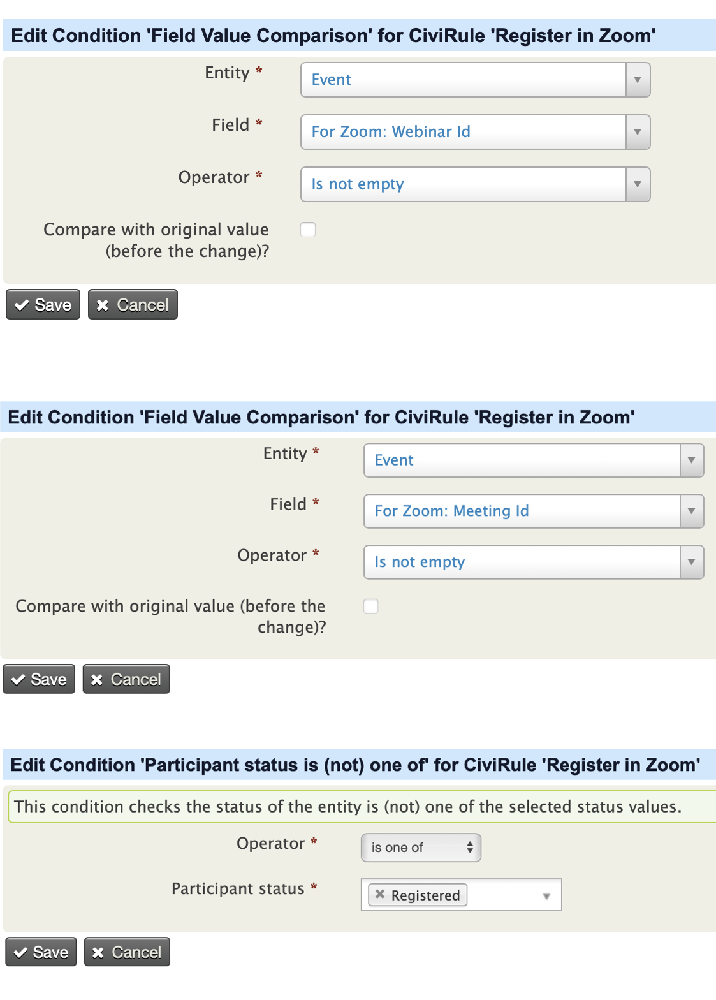
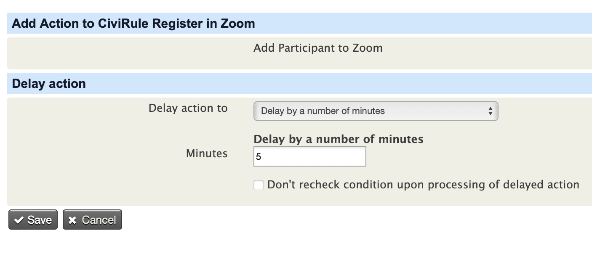
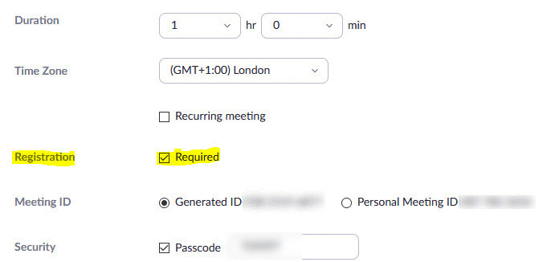
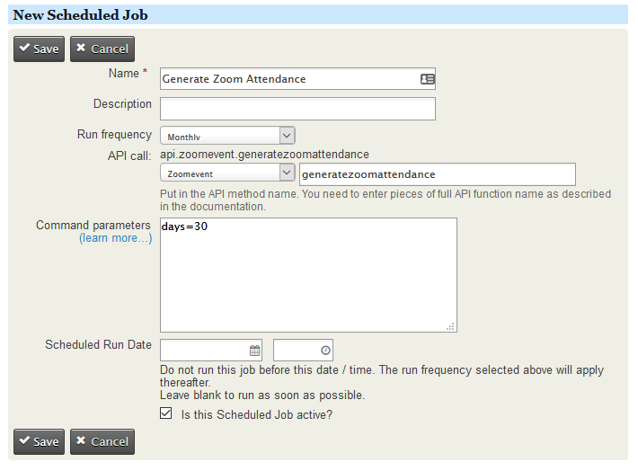
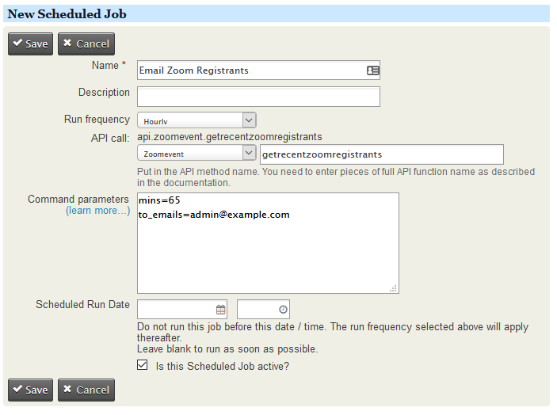
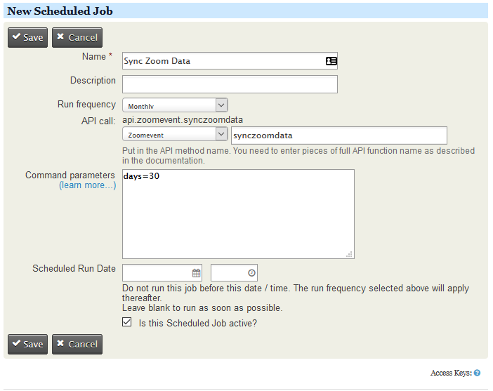
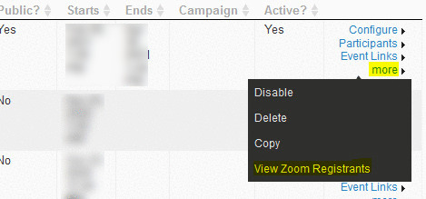
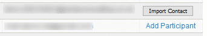

# ncn-civi-zoom
Civirules Conditions/Actions that talk with Zoom developed for NCN.

# What it does
This extension will connect CiviEvents with Zoom, allowing registrations for zoom events to be captured in your CiviCRM install via your website. This has a multitude of benefits, including GDPR compliance, using Zooms workflow, removing the need to manually export/import as well as being able to manage events in the same way you would any other CiviCRM events. This will also pull the registrants' details for the upcoming zoom based events and update them into the 'Event Zoom Notes' field of each event.

## Requirements

* PHP v7.0+
* CiviCRM 5.0+
* CiviRules extension
* A Paid Zoom Account

## Conflict with Drupal Devel Module 7.x-1.5

Fixed a known conflict with Drupal Devel Module 7.x-1.5 ([2559061](https://www.drupal.org/project/devel/issues/2559061))

## Installation

A helper Youtube installation video can be found [here](https://youtu.be/6rta9V3J7yc)

Follow the Setup guide below, the key steps are;

* Create a connector in Zoom (JWT App)
* Create relevant custom fields in CiviCRM for Events to hold zoom information
* Install the CiviCRM Zoom Extension. More details [here](https://docs.civicrm.org/sysadmin/en/latest/customize/extensions/#installing-a-new-extension) about installing extensions in CiviCRM.
* Connect CiviCRM to Zoom via settings

Following this you will then have the option, per event, to pass information over to zoom on registration of participants, either online or offline.

All of the setup and useage steps are outlined below.

## Setup
### Sign into Zoom and Create a JWT App

The JWT App within your Zoom account will allow you to connect CiviCRM to zoom, so that it can pass over participant information.

* Create a JWT app in your zoom account's [zoom market place](https://marketplace.zoom.us/develop/create) page using the instructions given in [the guide](https://marketplace.zoom.us/docs/guides/build/jwt-app).
* Keep a copy of the **API Key** and **API Secret Key** credentials, you'll need them to enter them into the CiviCRM Zoom settings

### Sign into CiviCRM and setup custom fields for Zoom
Create custom fields against the Event entity (you can select which types of events Zoom fields applicable too or leave blank for all events).
Also note we would recommend turning off the public setting on the custom field group as you probably dont want the IDs being exposed publicly on information pages.

The fields needed are
#### Zoom Account ID:
*As the extension supports multiple zoom accounts in a single installation this field will store to which zoom account the meeting or webinar belongs to.
* Please ensure that this custom field is set as **Data Type** to _Integer_ and **Field Type** to _Text_ as this field will only hold small natural numbers.
* Please ensure that this custom field is set as **View Only?** to _TRUE_ as its value is set from the 'zoom_account_list' and we don't want end users mistakenly entering invalid values.

#### Zoom Webinar ID
* Will hold Zoom Webinar IDs.
* Please ensure that this custom field is set as **Data Type** to _Number_ and **Field Type** to _Text_ as these fields will only contain large numbers (spaces in meeting numbers are trimmed before saving).

#### Zoom Meeting ID
* Will hold the Zoom Meeting ID.
* Please ensure that this custom field is set as **Data Type** to _Number_ and **Field Type** to _Text_ as these fields will only contain large numbers (spaces in meeting numbers are trimmed before saving).

### Sign into CiviCRM and install the CiviCRM Zoom extension

More details [here](https://docs.civicrm.org/sysadmin/en/latest/customize/extensions/#installing-a-new-extension) about installing extensions in CiviCRM.

### Sign into CiviCRM and configure the Zoom settings
* Install the extension
* Navigate  to the zoom settings as **Administer >> Zoom Settings >> Zoom Accounts Settings**.
* Create an entry for the zoom account (Note that the extension supports multiple Accounts)

* On clicking the **Add New zoom account** button you'll be taken to a page where you need to enter the details of the new zoom account. Note the name is purely an internal identifier, in the case of multiple zoom accounts it can be use to easily differentiate the options.

* Along with that you also need to enter the 'Base url' in the same settings page. Note the Base URL should be set to https://api.zoom.us/v2 if the extension doesn't automatically set it.

* Navigate  to the zoom sync data settings as **Administer >> Zoom Settings >> Zoom Data Sync Settings**.
* This page shows the list  of fields available in the zoom api for a Meeting or a Webinar.
* You can select the fields you wanted to sync with the civicrm participants and save it. These selected fields are created as custom fields under the custom group 'Zoom Data Sync' against particpants.

### Configure CiviRules to send participant information to Zoom
In order to pass the details over to Zoom the extension creates a new rule action "Add Participant to Zoom". The action uses the zoom details set on the event the participant has registered for and uses that to determine which event, if any, to register them into Zoom. What you will need to do is determine how long a delay, if any, you want before the participant is pushed to zoom.

Once you've decided this you can create a new CiviRule as per the below.

**Add Trigger: Event Participant is added**

## Enabling the integration for a CiviEvent
### Configuring the Zoom Event
* Once the meeting/webinar has been created in the zoom, need to ensure whether the 'Required' check box has been marked against 'Registration' field as below.
* Also need to ensure that the additional fields(other than Last Name) are not enabled as required fields under the registration options.

### Configure the CiviEvent
* Once the settings page has been created then you can see the configured zoom account ids list as drop down box just above the Webinar Id field , whenever you Add/Edit an event as below.
* Once you've selected a zoom account and entered a Webinar Id / Meeting Id your webinar/meeting id will be verified with the selected zoom account along with a message next to the text box as below.

## Creating Scheduled Jobs
### Scheduled Job for Zoom attendance
* Once you've created a zoom event, you need to create a scheduled job for that event. The Api Entity should be **Zoomevent** and the api action should be **Generatezoomattendance**. This api has only one parameter which is ***days*** this will be used to pickup the events which ended up within that number of days given(using the event's end date). For example if the days=10, then events(in your civi) ended within past 10 days from current date will be picked up and only for these events the participants' status  will be picked up from the zoom and updated in the civicrm. You can schedule the Job as frequent  as you need it to run.
* It calls the following zoom apis:
  1. Get Webinar Absentees
  2. Get Meeting Participants
* It updates the partcipant status accordingly as Attended
An example of the scheduled job setup has been done below

### Scheduled Job for emailing new Zoom registrants
* Once you've created a zoom event, you need to create a scheduled job for that event. The Api Entity should be **Zoomevent** and the api action should be **Getrecentzoomregistrants**. This api has two parameters one is ***mins*** i.e registrants who registered that many 'minutes'  before will be filtered and their details(such as First name, Last name and Email) will be updated to the 'Event Zoom Notes' custom field under that civi event. The other parameter is the ***to_emails*** , which is the Email address to which you want the filtered regitrants list could be sent, for multiple email addresses seperate each by a comma(,) symbol.
* It calls the following zoom apis:
  1. List Webinar Registrants
  2. List Meeting Registrants
 * It also updates the details these registrants' details to the custom field 'Zoom Event Notes' of the corressponding event.
An example of the scheduled job setup has been done below

### Scheduled Job for syncing Zoom data with with civi participants
* Once you've created a zoom event, you need to create a scheduled job for that event. The Api Entity should be **Zoomevent** and the api action should be **Synczoomdata**. This api has only one parameter which is ***days*** this will be used to pickup the events which ended up within that number of days given(using the event's end date). For example if the days=10, then events(in your civi) ended within past 10 days from current date will be picked up and only for these events the participants' data will be synced from zoom and updated in the civicrm. You can schedule the Job as frequent  as you need it to run.
* It calls the following zoom apis:
  1. Get Meeting Participant Report
  2. Get Webinar Participant Report
  3. Get Webinar Absentees
* It updates the details obtained from the above zoom apis to the custom  group 'Zoom Data Sync'.
* The fields that would be updated against the participant record can be controlled by the selecting the custom fields in the page 'Zoom Data Sync Settings'.
* Also for  the entry and exit time we pickup the first  entry time and last leaving time in case the participant has joined and left the meeting/webinar more than once.
* For each entry/exit, the duration will also be stored against the participant record. And such that a maximum of 20 durations will be stored against a participant record.
* Apart from that the total duration will be stored in a separate field.
* An example of the scheduled job setup has been done below
* It also updates the unmatched zoom participants details(name and email) to the custom field 'Unmatched Zoom Participants' of the corressponding event.

### Others
* Added a new custom field 'Zoom Join Link' to store zoom joining link which will be automatically updated upon saving the event. This will be common link for the meeting/webinar.
* Added a new custom field 'Zoom Participant Join Link' which is unique for each registrant in zoom to join the meeting/webinar. This will be automatically updated when the zoom participant is being pushed from civi to zoom.
* Added a link to the manage events page against every event to view the zoom registrants for that particular event.
* Added a new page to view the zoom registrants and also added an option to import the contacts/participants missing in civi.

